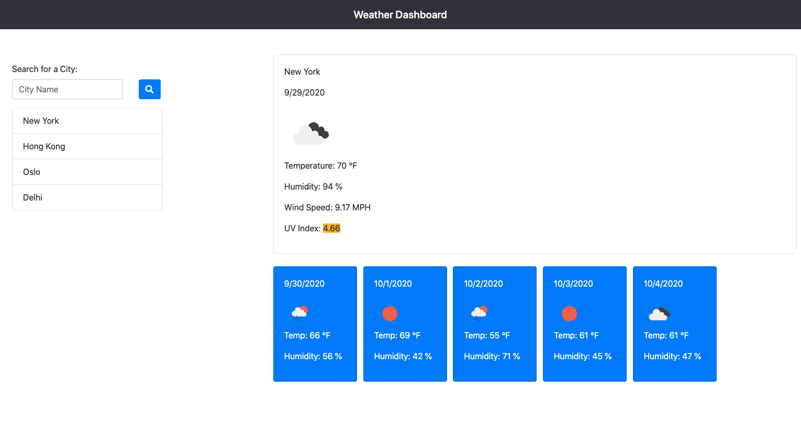

# Weather Dashboard

## Summary
The Weather Dashboard allows users to search and view the weather outlook of cities. For each city, it dynamically displays the current conditions including temperature, humidity, wind speed, and UV index. The UV index is color coded to indicate if conditions are favorable, moderate, or severe. It also displays a 5 day forecast which includes conditions, temperature, and humidity. Multiple cities may be searched and saved in a sidebar for easy future reference. The Weather Dashboard is a useful tool for every day use as well as traveling.

## Features
* The Open Weather API is used to retrieve weather data for current and forecasted conditions
    * The current day data is retreived via an AJAX call to the Current Weather Data API
    * The current day UV index is retrieved via an AJAX call to the UV Index API
    * The 5 day forecast is retrieved via an AJAX call to the One Call API

* jQuery is used to dynamically update information on the webpage for each city that is selected or searched
    * The current day conditions are dynamically updated to reflect a chosen city
    * The 5 day forecast is dynamically updated to also reflect a chosen city
    * The search history list is dynamically updated to include  new cities that are searched

* Local storage is used to store the search history list
    * Users can easily reference cities they've previously searched, even after a browser is refreshed

## Built With
* [Open Weather API](https://openweathermap.org/api/one-call-api) - provides current and forecasted weather data
* [jQuery](https://jquery.com/) - creates the dynamic features of the page in tandem with JavaScript
* [JavaScript](https://www.javascript.com/) - creates the dynamic features of the page
* [Bootstrap](https://getbootstrap.com/) - creates the mobile responsive layout
* [HTML](https://developer.mozilla.org/en-US/docs/Web/HTML) - creates the structure of the page
* [CSS](https://developer.mozilla.org/en-US/docs/Web/CSS) - styles HTML elements on the page
* [Git](https://git-scm.com/) - version control system to track changes in source code
* [GitHub](https://github.com/) - hosts repository and deploys page on GitHub

## Code
The below code demonstrates how an AJAX call is used to retrieve data from the Open Weather API.

    var coordURL = `http://api.openweathermap.org/data/2.5/uvi?lat=${lat}&lon=${lon}&appid={apikey}`;
    $.ajax({
        url: coordURL,
        method: "GET"
    }).then(function (response) {
        var uvIndex = response.value;
        if (uvIndex <= 3){
            $("#uvEl").html(`UV Index: ${uvIndex}`);
        } else if (uvIndex > 3 && uvIndex <=8){
            $("#uvEl").html(`UV Index: ${uvIndex}`);
        } else {
            $("#uvEl").html(`UV Index: ${uvIndex}`);
        }
        $("#current-weather").append(uvEl);
    })

## Deployed Link
[Weather Dashboard](https://engrebecca.github.io/weather-dashboard/)

## Site Picture

## Author
* Rebecca Eng
* [GitHub](https://github.com/engrebecca)
* [LinkedIn](https://www.linkedin.com/in/engrebecca/)

## Credits & Acknowledgements
* Documentation for the Current Weather API [Open Weather](https://openweathermap.org/current)
* Documentation for the One Call API [Open Weather](https://openweathermap.org/api/one-call-api)
* Documentation for the UV Index API [Open Weather](https://openweathermap.org/api/uvi)

## License
This project is licensed under the MIT license